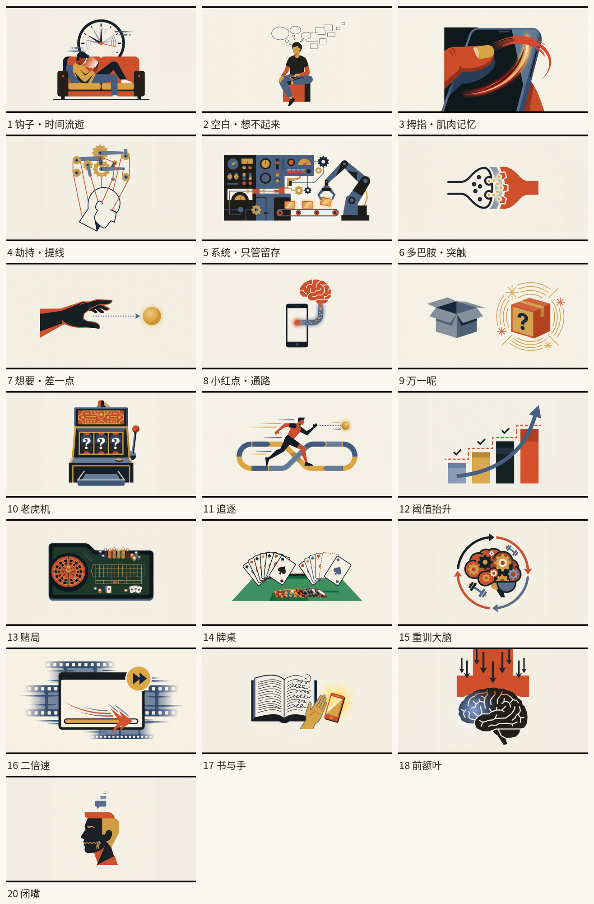

# 口播稿 → 知识类动画短片

> **凭据规则更新：** 用户的GitHub token采用独立密文保存。每个会话只提供一次有效解密口令，当前会话已提供就不再询问；不跨会话继承秘密或授权；见[加密凭据与逐次询问规则](docs/加密凭据与逐次询问规则.md)。本公开仓库只保存规则与工具，不默认上传密文或口令。

> 输入一段中文口播稿，输出一支带旁白、AI 插画**动画**（零件逐个入场 + 多状态帧）、逐字动画字幕和画面大字的 16:9 短片。
>
> 本仓库是这套流程的完整固化：提示词模板、TTS 方案、分镜规则、版面设计、动画参数、编码策略、质检阈值，以及可直接复用的合成代码。

**参考成品**：① 3 分 18 秒 / 1920×1080 / 31.4 MB　② 2 分 59 秒 / 1920×1080 / 24.4 MB（27 镜，含 11 镜多状态帧）
**参考流程耗时**：拆稿 10 min + 配音 15 min + 生图 3 轮 + 渲染 5 min

---

## 它长什么样

```
┌────────────────────────────────────┐
│                                    │
│   画窗 1920×900（2.13:1）           │  ← AI 插画 + 零件逐个入场 + 多状态帧 + 运镜
│   　　　　　　多巴胺　　　　　　　   │  ← 画面大字（自动落在留白处，弹入）
│                                    │
├────────────────────────────────────┤  ← 46px 羽化，插画淡出到纸面
│   纸带 180px 纯色 #F3EEE5          │  ← 字幕专属区（逐字浮现 + 关键词高亮）
└────────────────────────────────────┘
```



---

## 目录

| 文件 | 内容 |
|---|---|
| **[SKILL.md](SKILL.md)** | 完整流程文档（12 节）：拆稿、TTS、时间轴、生图、版面、**动画入场与状态帧**、字幕、大字、编码、质检 |
| **[音色档案.md](音色档案.md)** | 怎么在下一次对话里复现同一个 TTS 音色（含实测声学特征与参考音频） |
| **[启动提示词.md](启动提示词.md)** | 新会话里粘贴的那段话，以及"只改某一处"的说法 |
| **[分镜表-样例.md](分镜表-样例.md)** | 27 镜分镜表实例 |
| `scripts/` | `compose.py`（PIL 合成管线）、`script.py`（口播稿 + 时间轴）、`build_audio.py`（音轨拼接） |
| `reference/` | 音色样本（前 16 秒）+ 完整旁白轨，用于比对音色 |
| `docs/` | 底图样张 contact sheet |

---

## 快速开始

```bash
# 1. 写口播稿 → 填进 scripts/script.py 的 SEGMENTS，并定好 KEYS 关键词表
# 2. 用 TTS 分段合成 audio/seg01.mp3 …（见 SKILL.md §2）
# 3. 把每段实测时长回写 script.py 的 dur 字段
# 4. 生成底图到 art/（提示词模板见 SKILL.md §4.2）
# 5. 渲染
python3 scripts/build_audio.py                                  # 拼接音轨
python3 scripts/compose.py preview                              # 每镜中点出样帧，检查构图
python3 scripts/compose.py full --fps 25                        # 成片
```

**换一篇新稿子只需要改 3 处**：`script.py` 的 SEGMENTS、KEYS，以及重新生成 `art/` 底图。
版面、运镜、动画参数、编码策略全部不用动。

---

## 六个核心设计

**1. 纸带隔离，不是蒙版叠加**
第一版用"全屏插画 + 底部半透明渐变蒙版"，蒙版在字幕位置只有 18% 不透明度，而有的图把 25–44% 的内容堆在下方——必然糊成一团。改成上方 2.13:1 画窗 + 下方 180px **完全不透明**的纸带后，字幕与插画物理隔离，永不重叠。

**2. 底图自适应取窗**
画窗是 2.13:1，底图是 1.83:1，必须裁 14% 高度。简单居中裁会切到主体，所以按"纵向滑窗保留墨量最多 + 主体重心居中"打分。实测主体核心带保留率中位 100%、最低 96.9%。

**3. 时间轴建立在实测音频时长上**
按字数估语速，误差会累积到 5–10 秒。必须逐段读 TTS 音频的真实时长写回 `dur`，画面切点才能精确贴在每个换气口上。

**4. 大字靠留白探测自动落位**
给每张底图建 64×30 墨量密度图，7 个候选区里挑最空的，并加"不连着用同区 + 全局均衡"惩罚。同时限制同一个词全片最多 2 次、间隔 ≥15 秒——否则会出现 22 个字全挤左上、同一个词砸 4 次这种事故。

**5. 动画：零件逐个入场 + 多状态帧**

只有推拉运镜，观众仍会觉得是「一张会放大的图」。但**别用「整块主体呼吸 + 旋转」** —— 我第一版就是这么做的，用户反馈：**「看起来怪怪的，像贴纸在飘」**。原因：整块主体当成一个整体放大缩小、整体旋转，视觉上就是一张贴纸在晃，而不是「机制在动」。**运动量指标涨了 65%，观感反而更差**（详见 [SKILL.md §5.5](SKILL.md)）。

真正有效的两条，都用上：

- **零件逐个入场**（纯代码，0 张新图）：每张图拆成 1–6 个零件，按**左→右**依次滑入 + 淡入，1.2 秒内全部到位后**静止不动**。机制图基本都是「因果从左到右」，这个顺序刚好跟着叙事走。
- **多状态帧**（要再生图）：同一镜头出 2–3 张**不同状态**的图依次交叉溶解 —— 天平左倾→右倾、齿轮 0°→30°→60°、信号出发→半途→击中。这才是「机制真的在动」。
  关键技巧：**用已生成那张当参考图**去生成下一状态（`generate_image(images=[已有图])`），风格和构图能锁住，实测底色偏离 ≤5、墨框位移 ≤25px。

配套的两条保命规则：

- **给底图加一圈纸边**（`PAD = 1.18`）：AI 出图的主体常占满画面（实测 86%），取景窗也是 86%，零余量一推就切。加边后主体占比降到 72%，**截断从 42% 的取景降到 0**，而且成片更锐（放大倍率 1.58× → 1.34×）。
- **自适应推近上限** `z_fit`：按每张图算出「不切到零件的最大推近倍率」，再跟运镜值取 min。实测加边后 25/27 张能满推。

**6. 分段编码（血泪）**
2 GB 容器里，单行 ffmpeg 编码真实画面会在**第 512 帧**被 OOM 杀掉，且 stderr 全空、极难排查。改成每 ~900 帧一段（切在镜头边界）、段间 concat 拼接后彻底解决。喂噪声数据测不出来——噪声压出来只有 1 MB，x264 根本不吃内存。

---

## 性能对照

| 版本 | 单帧 | 全片 4961 帧 |
|---|---|---|
| v1（每帧高斯模糊 + PNG 传帧） | 1.28 s | 106 min |
| 烘焙静态层 + rawvideo + crf22 | 0.086 s | 7 min |
| 最终（veryfast + 画窗缩小） | **0.051 s** | **4.7 min** |
| 加入零件入场 + 30 张状态帧 | 0.089 s | 6.6 min（4487 帧） |

> 每帧要合成 1–6 个零件贴图，零件越多越慢；淡入的 alpha 按 1/24 量化缓存，避免每帧重算。状态帧只增加显存占用，几乎不增加耗时。

---

## 质检阈值

成片必须过的 11 项数值（详见 [SKILL.md §9](SKILL.md)）：

纸带纯净度（非文字区 ≈ #F3EEE5，抖动 <5）· 字幕墨迹 y ≥ 902 · 大字不污染纸带 · 大字出现 · 逐字动画墨量递增 · 画窗运动 >0.5%/0.4s · 无黑帧 · 分段接缝落在正常转场区间 · 帧数 = 时间轴 × fps · 音量 −23/−5 dB · 规格 1080p/25fps

---

## 常见问题

**Q：下次对话还能用同一个 TTS 音色吗？**
`voice_id` 只在当前会话有效。复现靠"固定试听文本 + `index=0` 参数 + 参考音频比对"三件套，见 [音色档案.md](音色档案.md)。

**Q：ffmpeg 命令跑不起来？**
本环境 PATH 里没有裸 `ffmpeg`，一律用 `imageio_ffmpeg.get_ffmpeg_exe()` 取路径。

**Q：生图一次能出多少张？**
`generate_image` 每轮上限 10 张。所以策略是"先出 10 张拼样张送审，风格过了再继续"。

**Q：提示词被内容审核拒了？**
去掉一切暗示对抗/暴力的动词（fight / struggle / pull），改写成静态构图（balanced / calm / static equilibrium）。

---

## 许可

MIT —— 见 [LICENSE](LICENSE)。
